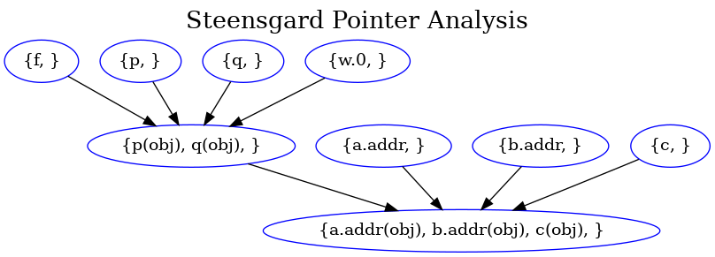

## pointer analysis

A simple prototype of pointer analysis. It currently includes:

- anderson/inclusion pointer analysis
- steensgard/unification pointer analysis

the default chosen algorithm is `anderson`, you can specify it in command line argument `-algo` follow by "steen" or "ander".

### Build & run

```shell
  mkdir build
  cd build
  cmake .. # you may need to change the hard-coded llvm path in `CMakeList.txt`

  # run a simple test
  chmod +x run.sh
  ./run.sh bc/test00.bc
  # for steensgard/unification pointer analysis, type
  ./run.sh bc/test01.bc -type steen
```

the points-to-graph will output as a ".png" file if you have `graphviz` installed. The sample figure:



other command line arguments:

- `-dump-module`: dump module
- `-dump-cons`: dump constraints

### reference

https://github.com/grievejia/andersen : A really good anderson implementation for study.